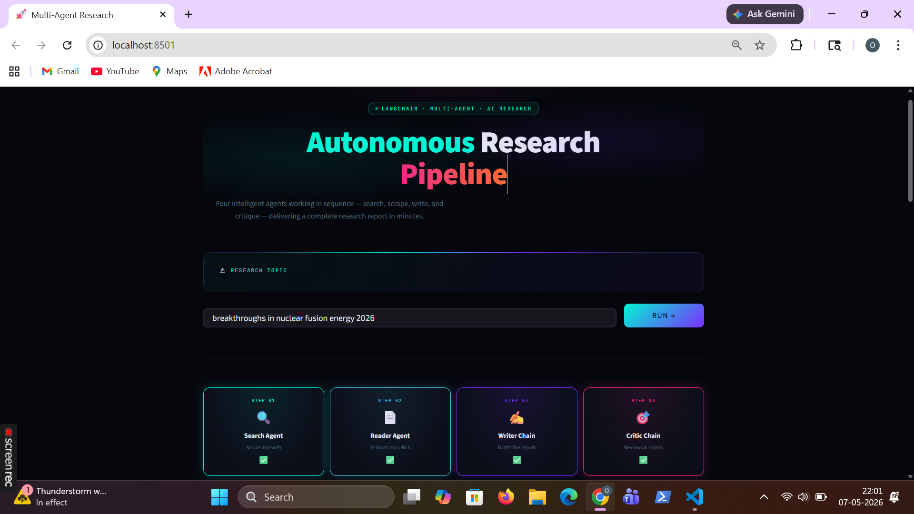

# 🔍 Multi-Agent Research System

An AI-powered multi-agent research pipeline that automates searching, reading, analyzing, critiquing, and generating high-quality research reports using multiple specialized AI agents.



---

# 🚀 Features

- Multi-Agent Architecture
- Automated Research Workflow
- Web Search Agent
- Reader & Summarizer Agent
- Writer Agent
- Critic/Reviewer Agent
- Structured Research Output
- Modular & Scalable Design
- Easy Integration with LLM APIs
- CLI-Based Research Execution

---

# 🧠 How It Works

The system uses multiple AI agents working together like a research team.

## Workflow

```text
User Query
    ↓
Search Agent
    ↓
Reader Agent
    ↓
Writer Agent
    ↓
Critic Agent
    ↓
Final Research Report

Each agent has a dedicated responsibility:
AgentResponsibilitySearch AgentSearches relevant information from the webReader AgentExtracts and summarizes useful contentWriter AgentCreates structured research reportsCritic AgentReviews and improves report quality


⚙️ Installation
1️⃣ Clone Repository
```bash
git clone https://github.com/onkarlonkar9/Multi-agent-research.gitcd Multi-agent-research
```

2️⃣ Create Virtual Environment
Windows
```bash
python -m venv venvvenv\Scripts\activate
```
Linux / Mac
```bash
python3 -m venv venvsource venv/bin/activate
```

3️⃣ Install Dependencies
```bash
pip install -r requirements.txt
```

🔑 Environment Variables
Create a .env file in the root directory.
Example:
```bash
OPENAI_API_KEY=your_api_keyTAVILY_API_KEY=your_api_key
```

▶️ Usage
Run the pipeline:
```bash
python multi-agent-pipeline.py
```
Then enter your research topic:
Enter a research topic: Cloud Computing

📸 UI Preview
Add your application screenshot as:
ui.png
inside the project root directory.
Example:
Multi-agent-research/ui.png

🛠️ Tech Stack


Python


LangChain


Multi-Agent Systems


LLM APIs


Tavily Search


Prompt Engineering


🎯 Use Cases


Academic Research


Market Research


AI Research Automation


Blog & Report Generation


Technical Documentation


Knowledge Aggregation


📈 Future Improvements


Web UI Dashboard


PDF Report Export


Voice-Based Research Queries


Real-Time Streaming Results


Agent Memory System


RAG Integration


Autonomous Research Planning


🤝 Contributing
Contributions are welcome.


Fork the repository


Create a feature branch


Commit changes


Push to your branch


Open a Pull Request


📜 License
This project is licensed under the MIT License.

👨‍💻 Author
Onkar Lonkar


GitHub: https://github.com/onkarlonkar9


⭐ Support
If you like this project:


Star the repository


Share it with developers


Contribute improvements


🔥 Vision
Build AI systems where multiple intelligent agents collaborate like real human teams to automate deep research and complex problem-solving.
Your current README is probably weak on three things that matter on GitHub:- Visual clarity- Fast setup- Clear architecture explanationThis version fixes all three. Also add:- `ui.png`- maybe `architecture.png`- sample output screenshotsbecause repositories with visuals and structured READMEs perform better for trust and engagement. :contentReference[oaicite:0]{index=0}::contentReference[oaicite:1]{index=1}
